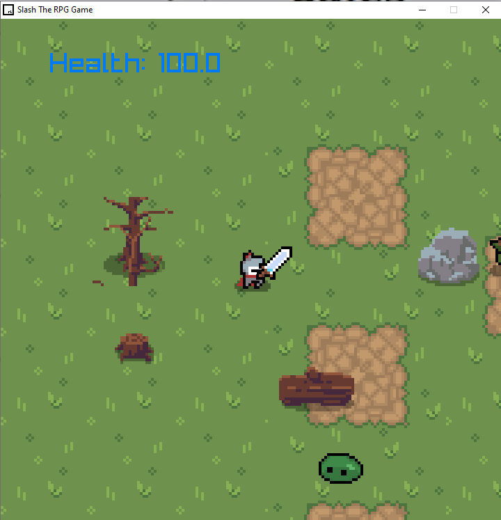

# Slash_RPGgame

<h3>RPG game i made in c++</h3>
Makefile is made by raylib and i also use raylib https://www.raylib.com/
its a really good libery and provide lots of stuff to make game just from vscode or any ide
2D assets are taken from https://itch.io/
so for i worked on character movement and world behavior also if player is idle it stay idle and if player is using(WASD) it switch to runiing movement.

Slash_RPG.cpp hold main world movement syntax and window syntax 

character. h have texture and character.cpp and BaseCharacter.cpp and .h hold source of player
prop.h & prop.cpp has texture and collision value
Main Ai source in Enemy.h and in main file Slash_RPG 

<i>This Contain those AI locations </i>       

"Enemy monster{
            Vector2{2050.f, 2500.f},
            LoadTexture("characters/goblin_idle_spritesheet.png"),
            LoadTexture("characters/goblin_run_spritesheet.png")"

Enemy Ai

